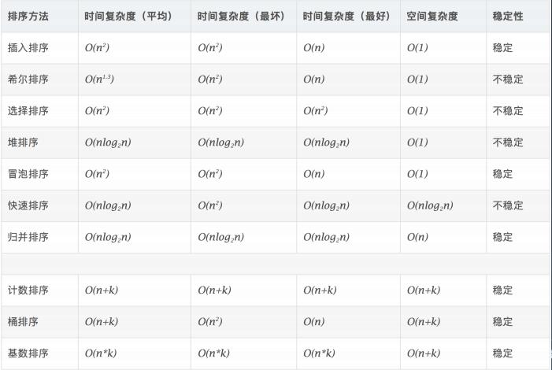

学习笔记## 第八周学习总结
本周主要学习了位运算，布隆过滤器，LRUCache的实现，以及排序算法
--
下面主要总结下排序算法
常见算法复杂度:


```java
插入排序
public static void insertSort(int[] arr) {
    for (int i = 1; i < arr.length; i ++) {
        int current = arr[i];
        // 二分查找插入位置
        int low = 0, high = i - 1;
        while (low <= high) {
            int mid = low + (high - low) >> 1;
            if (arr[mid] > current) high = mid - 1;
            else low = mid + 1;
        }
        for (int j = i - 1; j >= high + 1; j --) {
            arr[j + 1] = arr[j];
        }
        arr[high + 1] = current;
    }
}
```

```java
希尔排序
public static void shellSort(int[] arr) {
    int len = arr.length;
    for (int dk = len / 2; dk >= 1; dk /= 2) {
        for (int i = dk + 1; i < len; i ++) {
            // 子表插入排序
            if (arr[i] < arr[i - dk]) {
                int current = arr[i];
                int j = i - dk;
                for (; j >= 0 && current < arr[j]; j -= dk) {
                    arr[j + dk] = arr[j]
                }
                arr[j + dk] = current;
            }
        }
    }
}
```

```java
冒泡排序,这里做了部分优化,其实还有进一步优化的空间
public static void bubbleSort(int[] arr) {
    int len = arr.length;
    for (int i = 0; i < len; i ++) {
        boolean flag = false;
        for (int j = len - 1; j < i; j --) {
            if (arr[j - 1] > arr[j]) {
                // 交换元素
                int temp = arr[j - 1];
                arr[j - 1] = arr[j];
                arr[j] = temp;
                flag = true;
            }
        }
        if (flag == false) return;
    }
}
```

```java
选择排序
public static void selectSort(int[] arr) {
    int len = arr.length;
    for (int i = 0; i < len - 1; i ++) {
        int min = i;
        for (int j = i + 1; j < len; j ++) {
            if (arr[j] < min) min = j;
        }
        if (min != i) {
            // 交换元素
            int temp = arr[i];
            arr[i] = arr[min];
            arr[min] = arr[i];
        }
    }
}
```
```java
public static void RadixSort(int A[],int temp[],int n,int k,int r,int cnt[]){
 基数排序
  //A:原数组
  //temp:临时数组
  //n:序列的数字个数
  //k:最大的位数2
  //r:基数10
  //cnt:存储bin[i]的个数  
  for(int i=0 , rtok=1; i<k ; i++ ,rtok = rtok*r){
      
      //初始化
      for(int j=0;j<r;j++){
          cnt[j] = 0;
      }
      //计算每个箱子的数字个数
      for(int j=0;j<n;j++){
          cnt[(A[j]/rtok)%r]++;
      }
      //cnt[j]的个数修改为前j个箱子一共有几个数字
      for(int j=1;j<r;j++){
          cnt[j] = cnt[j-1] + cnt[j];
      }
      for(int j = n-1;j>=0;j--){      //重点理解
          cnt[(A[j]/rtok)%r]--;
          temp[cnt[(A[j]/rtok)%r]] = A[j];
      }
      for(int j=0;j<n;j++){
          A[j] = temp[j];
      }
  }
 ``` 
 ```java
  归并排序
 public class MergeSort {
    /**
     * @param a 待排序的数组
     * @param n 数组大小
     */
    public static void mergeSort(int[] a, int n) {
        mergeSortRecursion(a, 0, n - 1);
    }

    /**
     * 递归调用的函数
     *
     * @param a
     * @param p
     * @param r
     */
    public static void mergeSortRecursion(int[] a, int p, int r) {
        // 递归终止条件
        if (p >= r) {
            return;
        }

        // 取p到r之间的位置q
        int q = p + (r - p) / 2;
        // 分治递归
        mergeSortRecursion(a, p, q);
        mergeSortRecursion(a, q + 1, r);

        // 将A[p...q]和A[q+1...r]合并为A[p...r]
        merge(a, p, q, r);
    }

    /**
     * 合并两个有序数组
     *
     * @param a 合并好的有序数组，需要放到这个位置上。
     * @param p
     * @param q
     * @param r
     */
    public static void merge(int[] a, int p, int q, int r) {
        int i = p;
        int j = q + 1;
        int k = 0;
        int[] tmp = new int[r - p + 1];

        // 最少把一个数组中的数据取完。
        while (i <= q && j <= r) {
            if (a[i] <= a[j]) {
                tmp[k++] = a[i++];
            } else {
                tmp[k++] = a[j++];
            }
        }

        // 判断哪个子数组中有剩余的数据。
        int start = i;
        int end = q;
        if (j <= r) {
            start = j;
            end = r;
        }
        // 将剩余的数据copy到临时数组 tmp。
        while (start <= end) {
            tmp[k++] = a[start++];
        }

        //将 tmp 中的数据拷贝回 a 中
        System.arraycopy(tmp, 0, a, p, r - p + 1);
    }
}
```
